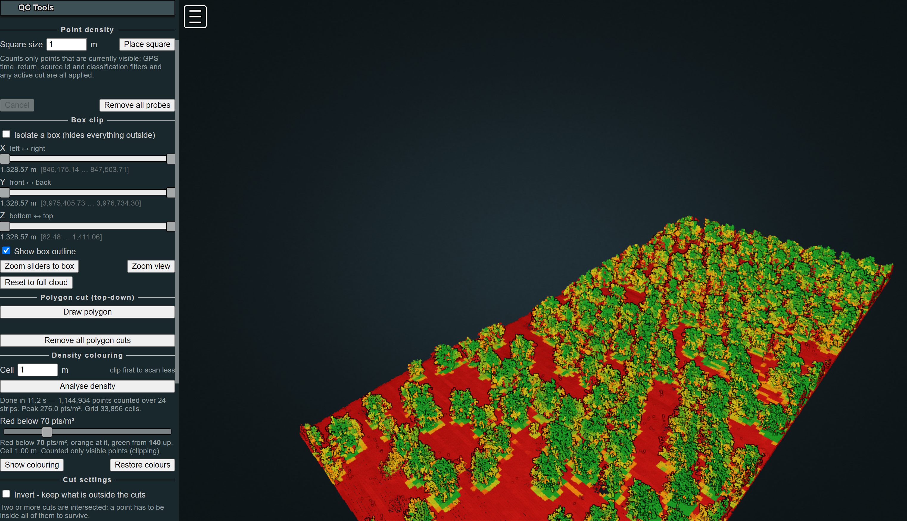

# PotreeDesktop + QC Tools

A fork of [PotreeDesktop](https://github.com/potree/PotreeDesktop) with four
tools for checking point cloud quality: measure local point density, isolate a
region with sliders or a drawn polygon, and colour a whole cloud against a
density specification.

Everything else is stock PotreeDesktop — the desktop build of
[Potree](https://github.com/potree/potree) by Markus Schütz.

## What this adds

| Tool | What it does |
| --- | --- |
| **Point density probe** | Place an N × N m square on the cloud and count every point in the column beneath it. Defaults to 1 m, so the count *is* the points/m². |
| **Box clip** | Six walls on three two-handle sliders — X, Y and Z min/max — to isolate a region. GPU-side, so instant on large clouds. |
| **Polygon cut** | Draw a shape and keep only what is inside it, extruded straight down. Your view is never moved. |
| **Density colouring** | Colour the whole cloud by points/m² against a spec, red below the limit through orange to green, with a live threshold slider. |

The probe and the density colouring both count only points that are **currently
visible** — GPS time, return, source id and classification filters and any active
cut are all applied. Filter to one collection pass and you measure that pass.

Full documentation: [`src/QC_TOOLS.md`](src/QC_TOOLS.md).

## Getting started

* Install [Node.js](https://nodejs.org/en/)
* `npm install`
* `npm start`, or run `PotreeDesktop.bat`
* Drag and drop a LAS/LAZ file to convert and load it, or a previously converted
  point cloud to load it directly

The tools appear in a **QC Tools** section in the sidebar.

## How it is put together

| File | What it is |
| --- | --- |
| `src/qc_tools.js` | All of the tool code |
| `src/qc_tools.css` | Panel styling |
| `src/QC_TOOLS.md` | Documentation, including the constraints and measurements behind the design |
| `index.html` | Three added lines: the stylesheet, the script, and `QCTools.install(viewer)` |
| `libs/potree/potree.js` | Four small patches, each marked `[QC Tools]` |

### Changes to Potree itself

Four defects in the bundled `libs/potree/potree.js` had to be fixed for this to
work. Each is marked with a `[QC Tools]` comment explaining what it fixes.
Re-apply them after updating Potree.

1. **`Renderer`** — three places read `vbos.get(name)` without checking, so an
   attribute added to a geometry after its buffer was built threw.
   `updateBuffer()` already creates a missing VBO; these just stopped it getting
   the chance.
2. **`Renderer`** — the same code assumed every displayed attribute has an entry
   in the file's point format. An attribute that exists only on the geometry does
   not, and must not.
3. **`NodeLoader`** — `worker.onmessage` was set but never `worker.onerror`, so a
   decoder worker that threw left the node flagged as loading and never returned
   its load slot. Four such nodes stop every load in the application.
4. **`ProfileRequest`** — it re-queues any node that is not yet loaded, so a node
   that can never load kept the request alive forever and it never completed.

These are upstream bugs rather than anything specific to these tools; a
full-resolution read of a cloud is just an unusually good way to meet them.

## Licence

BSD 2-Clause, the same licence as Potree and PotreeDesktop. See
[`LICENSE`](LICENSE) — it carries both the original copyright notice and the one
covering the additions here.

Bundled third-party libraries under `libs/` keep their own licences, which are
included alongside them. That includes the PotreeConverter binaries and
`laszip.dll` shipped under `libs/PotreeConverter*/`, which come from upstream
PotreeDesktop and retain their own licence files.

## Credits

* [Potree](https://github.com/potree/potree) and
  [PotreeDesktop](https://github.com/potree/PotreeDesktop) — Markus Schütz,
  TU Wien. Potree is funded by a combination of research projects, companies and
  individuals; see the About panel in the viewer for the full list.
* [PotreeConverter](https://github.com/potree/PotreeConverter) — bundled for
  converting LAS/LAZ on drop.
