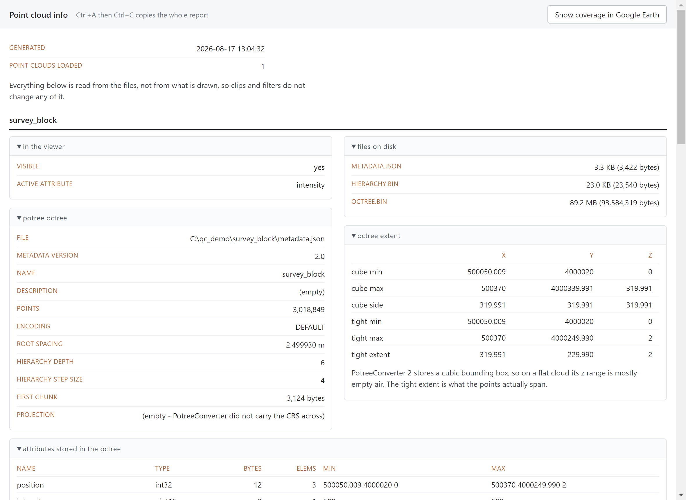

# PotreeDesktop + QC Tools

A fork of [PotreeDesktop](https://github.com/potree/PotreeDesktop) with five
tools for checking point cloud quality: measure local point density, isolate a
region with sliders or a drawn polygon, colour a whole cloud against a density
specification, and read back everything the files record.

Everything else is stock PotreeDesktop, the desktop build of
[Potree](https://github.com/potree/potree) by Markus Schütz.


## What this adds

| Tool | What it does |
| --- | --- |
| **Point density probe** | Place an N × N m square on the cloud and count every point in the column beneath it. Defaults to 1 m, so the count *is* the points/m². |
| **Box clip** | Six walls on three two-handle sliders (X, Y and Z min/max) to isolate a region. GPU-side, so instant on large clouds. |
| **Polygon cut** | Draw a shape and keep only what is inside it, extruded straight down. Your view is never moved. |
| **Density colouring** | Colour the whole cloud by points/m² against a spec, red below the limit through orange to green, with a live threshold slider. |
| **File info** | One click for everything the files record: LAS/COPC public header, every VLR decoded, coordinate system, compression, attribute ranges, classes present, average points/m², all as collapsible cards of selectable text, with a button to show the cloud's real coverage in Google Earth. |

The probe and the density colouring both count only points that are **currently
visible**: GPS time, return, source id and classification filters and any active
cut are all applied. Filter to one collection pass and you measure that pass.

File info is the opposite: it reads the files, so nothing on screen changes what
it says. Its **Show coverage in Google Earth** button writes the cloud's actual
plan-view shape as KML, not a bounding box. Separate blocks come out as separate
areas, and a lake or a gap in the returns comes out as a hole.



## Getting started

Requirements: [Node.js](https://nodejs.org/en/) and Windows. PotreeConverter and
everything else needed ships in `libs/`.

```bash
npm install
npm start
```

Or run `PotreeDesktop.bat`. Then drag and drop a LAS/LAZ file to convert and load
it, or a previously converted `metadata.json`, `cloud.js` or `.copc.laz` to load it
directly.

The tools appear in a **QC Tools** section in the sidebar.

## Documentation

| | |
| --- | --- |
| [`src/QC_TOOLS.md`](src/QC_TOOLS.md) | Full documentation: how each tool works, the constraints behind the design, and the measurements backing the numbers |
| [`CHANGELOG.md`](CHANGELOG.md) | What changed in each release |
| [`CONTRIBUTING.md`](CONTRIBUTING.md) | Where the traps are, and how to verify a change without a test suite |

Two sections of `QC_TOOLS.md` are worth reading before changing anything:
[Constraints worth keeping](src/QC_TOOLS.md#constraints-worth-keeping), five
changes that look like improvements and each break something subtly; and
[Potree patches](src/QC_TOOLS.md#potree-patches), which must be re-applied after
a Potree upgrade.

## Accuracy, and what these numbers are not

The density probe and density colouring **count points**: they read the cloud at
full resolution and the figures are exact for the region they cover.

File info's average points/m² is an **estimate**, measured from a coverage raster
built from a fraction of the points. On synthetic clouds of known footprint it
lands within a few percent, and against a full-resolution raster of a real 30M
point cloud it was 0.6% out. It is a whole-cloud average, so it is a sanity check,
not a figure to hold a delivery against. Use the probe or the colouring for that.

The [verification section](src/QC_TOOLS.md#verification) has the measurements.

## A note on Electron and security

This is a local desktop viewer. It runs with `nodeIntegration` enabled and
`contextIsolation` disabled, inherited from upstream PotreeDesktop and needed
because the tools read point cloud files straight off the disk. That means any
page loaded in the window has full access to the machine, so **only ever point it
at your own local files.**

The pinned Electron version is old. Upgrading it is not difficult but it does risk
the four `potree.js` patches and the rendering behaviour they fix, so it wants
doing deliberately with the verification steps in
[`CONTRIBUTING.md`](CONTRIBUTING.md) rather than as a drive-by bump.

## How it is put together

| File | What it is |
| --- | --- |
| `src/qc_tools.js` | The four viewer tools |
| `src/qc_fileinfo.js` | The file info report |
| `src/qc_tools.css` | Panel styling |
| `src/QC_TOOLS.md` | Documentation, including the constraints and measurements behind the design |
| `index.html` | Four added lines: the stylesheet, the two scripts, and `QCTools.install(viewer)` |
| `src/desktop.js` | Two additions marked `[QC Tools]`, so a converted octree can still name the file it came from |
| `main.js` | One addition marked `[QC Tools]`, so the report window does not get Electron's stock menu |
| `libs/potree/potree.js` | Four small patches, each marked `[QC Tools]` |

### Changes to Potree itself

Four defects in the bundled `libs/potree/potree.js` had to be fixed for this to
work. Each is marked with a `[QC Tools]` comment explaining what it fixes.
Re-apply them after updating Potree.

1. **`Renderer`**: three places read `vbos.get(name)` without checking, so an
   attribute added to a geometry after its buffer was built threw.
   `updateBuffer()` already creates a missing VBO; these just stopped it getting
   the chance.
2. **`Renderer`**: the same code assumed every displayed attribute has an entry
   in the file's point format. An attribute that exists only on the geometry does
   not, and must not.
3. **`NodeLoader`**: `worker.onmessage` was set but never `worker.onerror`, so a
   decoder worker that threw left the node flagged as loading and never returned
   its load slot. Four such nodes stop every load in the application.
4. **`ProfileRequest`**: it re-queues any node that is not yet loaded, so a node
   that can never load kept the request alive forever and it never completed.

These are upstream bugs rather than anything specific to these tools; a
full-resolution read of a cloud is just an unusually good way to meet them.

## Licence

BSD 2-Clause, the same licence as Potree and PotreeDesktop. See
[`LICENSE`](LICENSE), which carries both the original copyright notice and the one
covering the additions here.

Bundled third-party libraries under `libs/` keep their own licences, which are
included alongside them. That includes the PotreeConverter binaries and
`laszip.dll` shipped under `libs/PotreeConverter*/`, which come from upstream
PotreeDesktop and retain their own licence files.

## Credits

* [Potree](https://github.com/potree/potree) and
  [PotreeDesktop](https://github.com/potree/PotreeDesktop), by Markus Schütz,
  TU Wien. Potree is funded by a combination of research projects, companies and
  individuals; see the About panel in the viewer for the full list.
* [PotreeConverter](https://github.com/potree/PotreeConverter), bundled for
  converting LAS/LAZ on drop.
